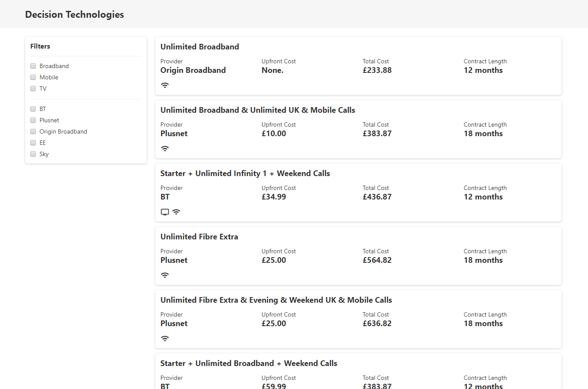

# Decision Technologies Front-End Technical Test

## Getting started

Please fork this repository to get started.

### Prerequisites

- NodeJS (at least latest LTS)
- Modern browser that supports ES6+ (classes, arrow functions etc)

## Scenario

The aim of this exercise is to implement the filter logic for a 'broadband deals' grid and add a sorting dropdown to sort the filtered results.



This codebase is written in vanilla JavaScript. We would like you to avoid using any frameworks or libraries for this task (e.g. lodash, underscore etc). You are free to use any modern JavaScript language features that are supported in modern evergreen browsers (the compile step does not transpile ES6 to ES5, so experimental language features may not work). We will be assessing your submission in Chrome.

You shouldn't need to do any work with styling or markup as the focus is on implementing the filter logic. However, if you get time and you'd like to flesh out the UI/site in anyway to show off your skills, feel free!

### Mininum expectations

We are expecting a submission that shows an understanding of TDD principles. Please provide a public link to a git repository for us to download and analyse your code (GitHub or similar). Please commit to this repository as you complete the exercise. We are not looking for elapsed time, but we are looking for good source control habits.

The tests are written in [Jest](https://jestjs.io/) and an initial test suite can be found in `src/scripts/__tests__`.

> ℹ️ NOTE: You will find the JSON data for the deals in `public/db.json`

### Filter criteria

- **WHEN** no filters applied **THEN** show all **11** deals
- **WHEN** filtering by _broadband_ **THEN** show the **4** broadband only deals
- **WHEN** filtering by _broadband_ **AND** _tv_ **THEN** show the **4** deals for broadband and tv only
- **WHEN** filtering by _broadband_ **AND** _mobile_ **THEN** show the **1** deal for broadband and mobile only
- **WHEN** filtering by _Sky_ **THEN** show the **1** deal for Sky only
- **WHEN** filtering by _BT_, _broadband_ **AND** _tv_ **THEN** show the **2** deals for BT with broadband and tv only

> ℹ️ NOTE: 'Broadband' and 'Fibre Broadband' should be considered the same product. 'Phone' should be ignored.

### Sorting criteria

A select should be added to the page with the options: "Default", "Upfront cost", and "Total cost".

- **WHEN** sorting by "Default" apply no sorting
- **WHEN** sorting by "Upfront cost" sort by the upfrontCost property
- **WHEN** sorting by "Total cost" sort by the sum of the upfrontCost and totalContractCost properties

## Getting set up

To get the site up and running, follow these simple steps:

```bash
# Install dependencies
npm install

# Serve the site and the JSON server
npm start
```

By default, the JSON server runs at `http://localhost:3000`, and the site is served from `http://localhost:5000`.

To run the test suites, you can use the following commands:

```bash
# Single run of test suites
npm run test

# Run test suites in 'watch' mode
npm run test:watch
```

## Commands

Run commands via NPM e.g. `npm run test:watch` from the project root.

| Command      | Description                                    |
| ------------ | ---------------------------------------------- |
| `test`       | Single run of test suites                      |
| `test:watch` | Run test suites in 'watch' mode                |
| `clean`      | Delete compiled assets                         |
| `db`         | Serve JSON data                                |
| `serve`      | Serve site, automatically open default browser |
